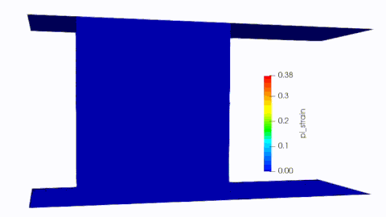

# WeldFormFEM – Open-Source FEM Solver for Large Deformation Processes

WeldFormFEM is an open-source Finite Element solver designed for nonlinear solid mechanics simulations 
involving large deformations, contact, and material plasticity.

Originally developed for forging simulations, the solver is modular and extensible, making it suitable for a wide range of forming and manufacturing processes such as:

Updated Lagrangian Implicit & Explicit Finite Element Method (FEM) CPU/GPU based solver. \
WeldFormFEM works both on Ubuntu and Windows. \
You can select to build it to CPU and GPU only by changing a single CMAKE var. \

- Forging
- Extrusion and stamping
- Indentation and hardness tests
- Solid mechanics under large strains
- Custom research on material behavior

## Key Features
- Implicit Velocity-Based Quasi-Static Solver (IVBQS)
- Explicit Dynamic Time integration
- Plasticity and large deformation support
- Remeshing for element quality preservation
- Graphical User Interface (GUI) in active development
- Written in C++, with clean modular design
- Integration with VTK, OpenCascade, and other libraries
- Ideal for experimentation, research, and education

Use cases
Whether you're a researcher, engineer, or student, WeldFormFEM offers a sandbox for developing and understanding FEM solvers tailored to high-deformation processes. New capabilities like remeshing, GUI-based workflows, and scripting are actively being developed.

## Features
- Structure Of Arrays (SOA) data arrangement which allows fast CUDA accesing
- Explicit time integration
- C++/CUDA CPU/GPU(WIP) Architectures
- Constant Stress Tetra/Triangle Element with Average Nodal Pressure (ANP) for volumetric locking fixing
- Reduced Integration Hexaheadra with viscous hourglass control
- OpenMP (WIP) CPU  parallelization
- Contact algorithm (WIP)
- Automatic Remeshing (rezoning) (WIP)
- 2D Plain Strain/Axisymm & 3D
- Thermal-Mechanical coupling (WIP)

Remeshing (WIP, experimental) 

Locking (left) and fixing (right) tetra \
Compression cylinder \

Compression cylinder HEXA w/reduced integration - TETRA \

Bending \

Hexa/Quad Hourglass \

## Build instructions

CUDACXX=/usr/local/cuda-12.3/bin/nvcc cmake ../WeldFormFEM -DBUILD_GPU=ON

To update libraries (LSDynaReader and Math)

git submodule update --init --recursive

TO BUILD MMG AVOID USING VTK 

cmake PATH_DIR -DBUILD_MMG=ON -DUSE_VTK=OFF 

Link here #https://arnon.dk/matching-sm-architectures-arch-and-gencode-for-various-nvidia-cards/ to see different architectures. 

Cuurrently working axisymmetric with hourglass for area weight in F90 version

  reduced_int = .True.
  call AddBoxLength(0, V, Lx, Ly, 1.0d0, r, rho, h,reduced_int)

  !! AFTER ADD BOXLEN
  axisymm_vol_weight = .false.
  bind_dom_type = 3 !!!AXISYMM, AFTER CREATING BOX!

  
  elem%sigma_y(:,:) = 300.0e6
  
  do i=1,node_count
  print *, "NODE ELEMENTS "
    print *,"i count ", i , nod%elxnod(i),nod%nodel(i,:)
  end do

  nod%is_fix(:,3) = .true.
 
 

